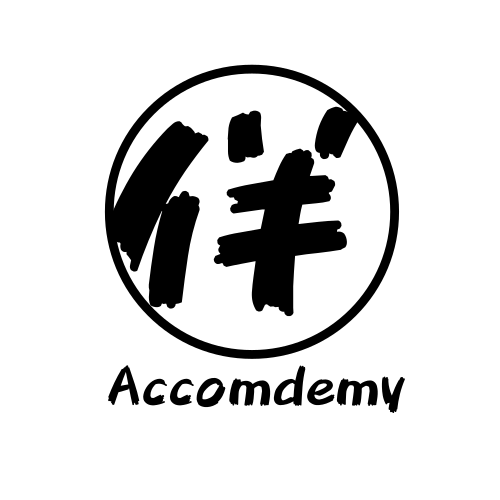
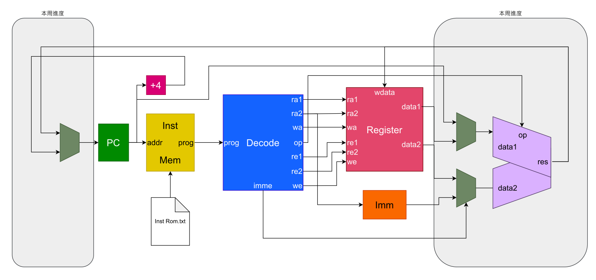

<h1 align="left">Accomdemy RV32I CPU</h1>

    
    
    
    

# 目錄
- [關於伴伴學](#關於伴伴學)
- [關於此專案](#關於此專案)
- [架構圖](#架構圖)
- [貢獻](#貢獻)
- [更新日誌](#更新日誌)
    - [20220802](#20220802)
    - [20220804](#20220804)

# [關於伴伴學](https://hackmd.io/@accomdemy/SJsr63mkt)
伴伴學 Accomdemy 是由一群來自科技圈、新創圈、教育圈的夥伴們自發性組成的自學組織。

<h3 align="center" style="font-weight: bold;">
    "Accomdemy = Accompany + Academy！"
</h3>

我們希望透過陪伴式學習的線上分享會，讓每個想自學的人在自學的路上有趣又不孤單！

疫情肆虐全球，我們的學習模式也被迫改變，也許有些人想學習，卻不得其門而入；也許有些人想學習，經濟狀況卻不允許；也許有些人想學習，卻在成長路上感到孤單，但危機就是轉機，我們希望善用線上學習工具，透過陪伴引導的共學模式，讓「想擁有學習資源」的人不用擔心在家學習會被惰性吞沒 ，所以我們成立了「伴伴學 Accomdemy」。

我們相信教育和科技可以使人突破自我限制，讓這個世界變得更美好；而我們相信最好的學習方法來自於有動力的自主學習，所以我們號召有同樣信仰的夥伴們一起付出自己所長，讓想要學習卻不得其門而入的人能夠享受學習的趣味，即時獲得有經驗的導師 (Mentor) 指導解惑，讓學習的路上有趣又不孤單。

最後，歡迎加入[伴伴學Discord！](https://discord.com/invite/rB7sc3UMTx)

# [關於此專案](https://hackmd.io/@accomdemy/BJprQ8Xjc/)
> 提示：當前我們想要完成的目標可以在issue裡面看到。

2022的暑假，我們在線上舉辦RiscV伴學松，透過每周的活動時間，在「大家都不懂」的情況下，一起學習什麼是RiscV CPU，以及挑戰看看如何做出屬於自己的一顆CPU！

而這個專案則會是跟著伴學松一起進行，在這段暑假內會根據每個階段增加/修改專案內的Module，最終變成一顆可以在Vivado合成運行的CPU。

# 架構圖
> 更新日期：2022/7/28

    

# 貢獻

# 更新日誌
## 20220802 
- upload by Mingming: alu.v / cpu.v / decoder.v / regfile.v
## 20220804
- upload by Blackcat: alu.v / cpu.v / decoder.v / regfile.v
    - 修正排版
    - 補全 R-Type & I-Type Instruction
    - 補全 IMM 功能
    - 修正 Register 的條件判斷
